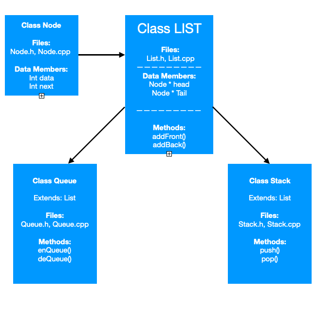

# StackAndQueue

### C++ Stack and Queue Implementations using a linked list.

## Overview:
Simple stack and queue implementations using a linked list.
Includes tests and and simple Command Line Interface (CLI) to test each implementation.

## Program Class Structure:


## Getting Started
LINUX
```
git clone https://github.com/natreed/StackplusQueue.git
g++ Main.cpp
./a.out
```

## Command Line Interface
### NOTE: CLI operators are 'put' and 'get' for both the Stack and the Queue. Easy to type.

### Initial Menu has 4 options:
- 1. Test:  Runs some validation testing and exits.
- 2. Stack: Opens CLI to push and pop operations from a stack.
--Stack options are 'put', 'get', return to Initial menu.
- 3. Queue: Opens CLI to demonstrate enqueue and dequeue operations from a queue.
--Queue ptions are 'put', 'get', return to Initial menu.
- 4. Exit program.